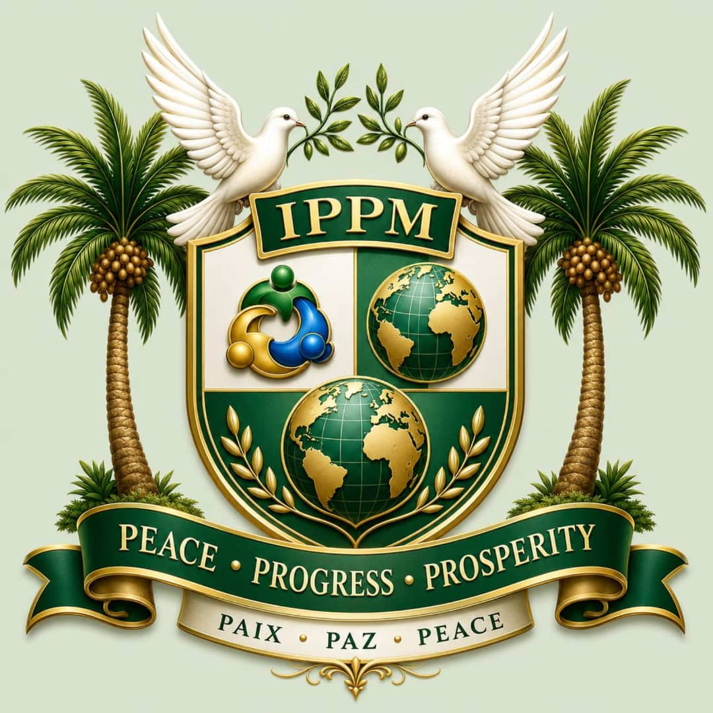

# IPPM-Online
IPPM Online

# Institute of Public Peace and Management (IPPM)



## Peace • Progress • Prosperity

### Through Knowledge • Through Partnership • For Humanity

---

# Overview

The Institute of Public Peace and Management (IPPM) is an international professional membership institute established to promote sustainable peace, leadership, professional excellence, research, innovation and institutional development.

This website serves as the Institute's primary digital platform for:

- Membership recruitment
- Professional development
- Executive education
- Research dissemination
- Institutional partnerships
- International collaboration
- Public communication

---

# Website

https://ippm.org

Membership Portal

https://ippm-tech.github.io/IPPM-On-line/

---

# Website Structure

```
index.html
about.html
membership.html
training.html
focus.html
contact.html

css/
    style.css
    responsive.css
    animations.css

js/
    script.js
    slider.js
    counter.js
    language.js

images/
    ippm-logo.png
    hero-banner.jpg
    whatsapp-qr.png
    favicon.png

assets/
    brochure.pdf

README.md
```

---

# Major Sections

## Home

Introduces IPPM, current programmes, membership and institutional highlights.

---

## About

History, mission, vision, values and institutional philosophy.

---

## Membership

Membership categories, professional designations, online application and benefits.

---

## Professional Development

Professional Development Series (PDS), executive education, conferences and annual programmes.

---

## Schools, Centres & Institutes of Professional Practice

Academic and professional divisions of IPPM.

---

## Contact & Partnership Hub

Membership enquiries, institutional partnerships, sponsorships and official communication.

---

# Technology

HTML5

CSS3

JavaScript

Responsive Design

GitHub Pages

FormSubmit Integration

---

# Supported Browsers

Google Chrome

Microsoft Edge

Mozilla Firefox

Safari

Opera

Mobile Browsers

---

# Responsive Devices

Desktop

Laptop

Tablet

Mobile Phone

---

# Languages

English

French (planned)

Spanish (planned)

---

# Current Professional Development Series

### PDS 001

Unlocking Growth Opportunities:
The Role of the Bank of Industry (BOI) in Financing Entrepreneurs, Professionals and Nigeria's Productive Economy.

29 August 2026

---

### PDS 002

Professional Training & Membership Induction

25–26 September 2026

---

### PDS 003

Executive Leadership, Governance & National Development Forum

28 November 2026

---

# Strategic Direction

IPPM is developing into an internationally recognized institute dedicated to:

Professional Membership

Executive Education

Research

Policy Development

Professional Certification

International Partnerships

Knowledge Exchange

Peacebuilding

Leadership Development

Digital Transformation

---

# Future Development

Interactive Learning Portal

Online Courses

Digital Certificates

Member Dashboard

Research Repository

International Chapters

Student Chapters

Mobile Application

AI Knowledge Assistant

Virtual Conferences

---

# Repository

The website is maintained using GitHub Pages.

Updates are coordinated through the IPPM Digital Development Project.

---

# Contact

Institute of Public Peace and Management (IPPM)

Sheraton Hotel

30 Mobolaji Bank Anthony Way

Ikeja, Lagos

Nigeria

Telephone

+234 705 252 6342

+234 706 667 8914

+234 802 819 8223

Email

ceo@ippm.org

info@ippm.org

Website

www.ippm.org

---

© 2026

Institute of Public Peace and Management (IPPM)

All Rights Reserved.
